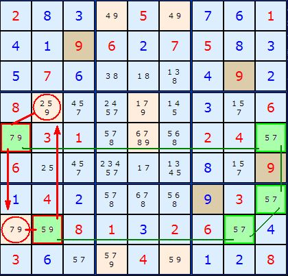

# 50 · Y-Wing Chains

> **Level:** Diabolical (deprecated; now part of XY-Chains) · **Family:** Bivalue chains · **Prerequisites:** [Y-Wing](../07-y-wing/README.md), [Remote Pairs](../49-remote-pairs/README.md) · **Superseded by:** [XY-Chains](../25-xy-chains/README.md)
> Diagrams: [sudokuwiki.org/Y_Wing_Chains](https://www.sudokuwiki.org/Y_Wing_Chains) by Andrew Stuart. Text: original to this guide.

## In one sentence

A [Y-Wing](../07-y-wing/README.md) whose single pivot is replaced by an **odd-length chain of identical pairs** (a [remote pair](../49-remote-pairs/README.md) chain). The ends of that chain behave just like a single pivot.

## The intuition

In a Y-Wing, the single pivot `{A,B}` is either A, which forces pincer 1 `{A,Z}` to Z, or B, which forces pincer 2 `{B,Z}` to Z. A chain with an **odd number** of identical `{A,B}` cells (1, 3, 5, ...) can stand in for that pivot, because its first and last cells always hold the **same** digit:

```
pincer1 {A,Z} ─ [A,B] ─ [A,B] ─ [A,B] ─ pincer2 {B,Z}
                 first           last
       first → last is an EVEN number of steps → they hold the SAME digit
```

The **first** pivot cell sees pincer 1, and the **last** one sees pincer 2. If both ends are A, pincer 1 loses A and becomes Z. If both ends are B, pincer 2 loses B and becomes Z. Either way, **one pincer is Z**, exactly as with a single-cell pivot.

## Example



The pivot chain is three `{5,7}` cells (green). The pincers (red borders) are `{7,9}` and `{5,9}`. Whichever way the 5/7 chain resolves, one pincer is 9, so the two cells that see both pincers (red circles) lose their **9**.

▶ [Load position](https://www.sudokuwiki.org/sudoku.htm?bd=283050761419627583576000492800000306031000240600000809142000930008132604360040128)

## Why it's deprecated

This is just an [XY-Chain](../25-xy-chains/README.md) that happens to have identical cells in the middle. Learn XY-Chains and you get this for free.
