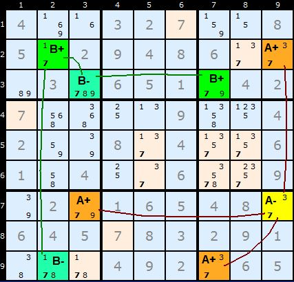
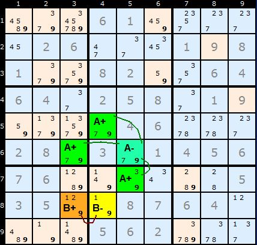
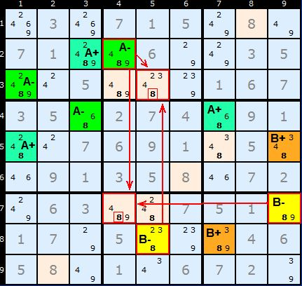
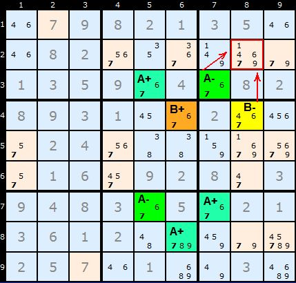

# 51 · Multi-Colouring

> **Level:** Diabolical (deprecated: simpler techniques always got there in testing) · **Family:** Single-digit colouring · **Prerequisites:** [Simple Colouring](../06-simple-colouring/README.md)
> Diagrams: [sudokuwiki.org/Multi_Colouring_Strategy](https://www.sudokuwiki.org/Multi_Colouring_Strategy) by Andrew Stuart. Text: original to this guide.

## In one sentence

Colour **two separate** Simple Colouring networks on the same digit (A± and B±). The way the two networks **see each other** can still prove that one colour is false, or that a cell is.

## Setup

For one digit:
- Network **A**: colours **A+** / **A−** (one of them is all true)
- Network **B**: colours **B+** / **B−**, which **doesn't link** to A (a unit with 3+ candidates separates them)

You need four colours, so get your coloured pencils out.

## Type 1: one colour sees both colours of the other network

> If cells of colour **A+** (between them) see **both B+ and B−**, then **A+ is false**.

Why: one of B+ or B− is true. If A+ were also true, some A+ cell would share a unit with a true B cell, which is two Xs in one unit. So A+ is false, and every A+ candidate can be removed.

Digit **7**: each **A+** cell sees a B+ or a B− (and between them, both). So all the A+ 7s go.

▶ [Load position](https://www.sudokuwiki.org/sudoku.htm?bd=400327008502948600030651042700009004200804006104006009020165480645783291000492065)

The chains can be short. Network B here is only two cells long.

▶ [Load position](https://www.sudokuwiki.org/sudoku.htm?bd=000610000026000198100820064640258019000046000280301456760000005350087640000562000)

## Type 2: two colours clash, so their opposites cover

> If **A+** and **B+** share a unit, then at least one of **A−** and **B−** is true. Any cell that sees **both an A− and a B−** loses the digit.

Digit **8**: A+ and B+ share units, so one of A−/B− is true. The 8s in **C5** (seeing B4 and H5) and **G4** (seeing B4 and H5/G9) are removed. (The diagram uses RxCy coordinates: R3C5 = C5, R2C4 = B4, R8C5 = H5, R7C9 = G9.)

▶ [Load position](https://www.sudokuwiki.org/sudoku.htm?bd=030715080710060035005000167350274091007691050091358072063007510170500046580106720)

A smaller case on **7**: just one cell sits where an A− and a B− overlap, and it loses its 7.

▶ [Load position](https://www.sudokuwiki.org/sudoku.htm?bd=079821350082000000135904082893100200024000000016092803948305021361200000257010030)

## Why it's deprecated

[X-Cycles](../14-x-cycles/README.md) / [AICs](../32-alternating-inference-chains/README.md) can join the two networks through a weak link, which makes the same deduction in a single chain. Multi-Colouring is still a nice way to *picture* why those chains work.
