# 52 · Empty Rectangles

> **Level:** Tough (retired on sudokuwiki in favour of [Rectangle Elimination](../08-rectangle-elimination/README.md)) · **Family:** Single-digit chains · **Prerequisites:** [Intersection Removal](../03-intersection-removal/README.md)
> Diagrams: [sudokuwiki.org/Empty_Rectangles](https://www.sudokuwiki.org/Empty_Rectangles) by Andrew Stuart. Text: original to this guide.

## In one sentence

If digit X in a box is confined to **one row plus one column** (a "+" shape, so four cells forming a rectangle hold no X), then X is **somewhere on that cross**. Combine that with a strong link outside the box to eliminate X where the two meet.

## Step 1: find the "empty rectangle"

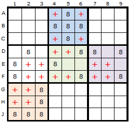

In each box, look for a 2×2 block of cells (not necessarily adjacent) that holds **no** X. When that happens, every remaining X in the box lies on one row and one column, which together make a cross shape. The red crosses mark these for digit 8.

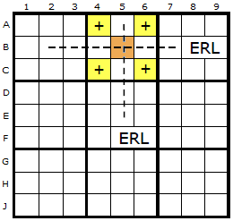

The row and column of the cross are the **Empty Rectangle Lines**.

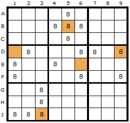

They meet at the **Empty Rectangle Intersection (ERI)**, the brown cell. Think of the ERI as "X is on this row of the box **or** this column of the box".

## Step 2: combine with a strong link

```
              ERI column
                 │
   ERI row ──── ERI ─────────── Z   ← victim: on the ERI row, in Y's column
                 │               │
                 │               │
                 X ════════════  Y   ← strong link (only 2 Xs in this row)
              (X is on the ERI column)
```

- If **Y** is X, then Z (same column) isn't.
- If **Y** isn't X, the strong link puts X at **X**. That's on the ERI column, so the box's X can't be on its column part, which leaves the **row part**. That knocks out Z (same row).

Either way, **Z ≠ X**.

| Arrangement 1 | Arrangement 2 |
|---|---|
| 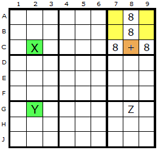 | 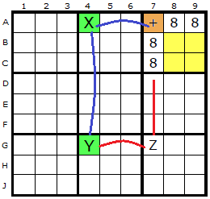 |

---

## Worked examples

### A real one

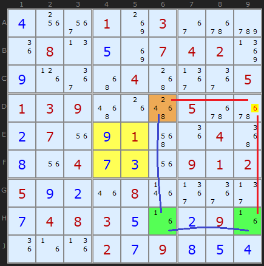

In box 5 the 6s are at **D4, D5, E6, F6**. They all lie on row D or column 6, with the ERI at **D6** (orange). Row H has exactly two 6s, **H6** and **H9** (green). H6 is on the ERI column, so **D9**, at the crossing of the ERI row and H9's column, loses its 6.

▶ [Load position](https://www.sudokuwiki.org/sudoku.htm?bd=400103000080507420900040005139000500270910040804730912592080000748350290000279854) (untick Rectangle Elimination)

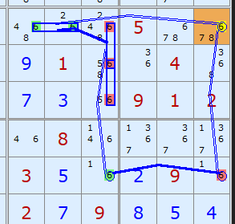

*The same deduction written as a [Grouped X-Cycle](../27-grouped-x-cycles/README.md).*

### Double

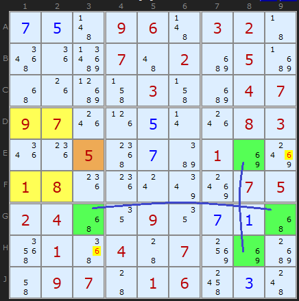

The ERI at **E3** works with **two** strong links on 6: row G (**G3–G9**) and column 8 (**E8–H8**). These remove 6 from **E9** and from **H3**.

▶ [Load position](https://www.sudokuwiki.org/sudoku.htm?bd=750960320000702050000030047970050083005070100180000075240090710010407000097016030)

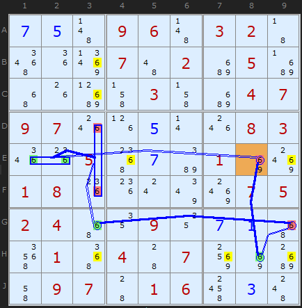

*Written as a continuous grouped loop, it finds even more.*

### Perfectly centred

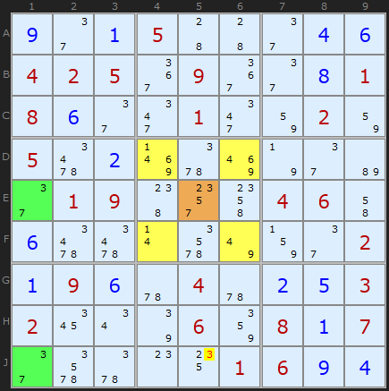

A textbook-symmetric ER on 3, from the same Klaus Brenner puzzle as the [hidden quad](../02-hidden-candidates/README.md) example.

▶ [Load position](https://www.sudokuwiki.org/sudoku.htm?bd=901500046425090081860010020502000000019000460600000002196040253200060817000001694)

### Triple

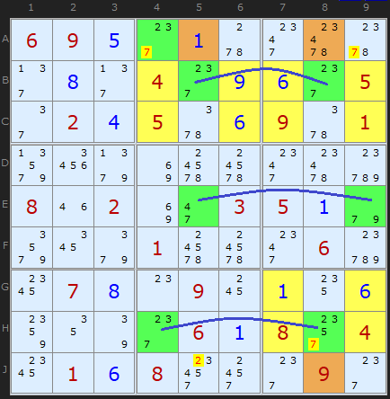

Three empty rectangles in one step. Try also [this puzzle](https://www.sudokuwiki.org/sudoku.htm?bd=69..........4....5.2.5..9.1.........8.2..35.....1...6..7..9........6.8.4.1.8...9.), which has three different ERs at once.

▶ [Load position](https://www.sudokuwiki.org/sudoku.htm?bd=695010000080409605024506901000000000802003510000100060078090106000061804016800090)

---

## Which should you learn?

[Rectangle Elimination](../08-rectangle-elimination/README.md) finds the same eliminations with a simpler mental model ("would this empty a box?"). Learn that first. Empty Rectangles are worth knowing because many other guides and apps use the name.
