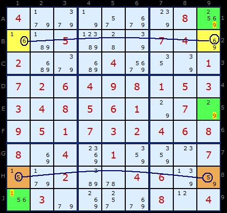
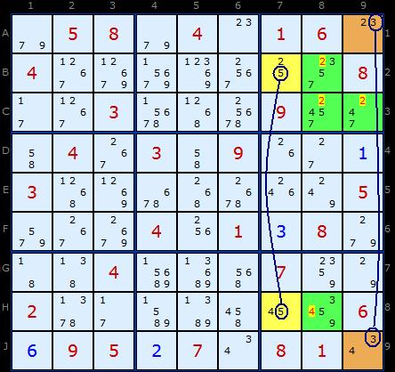

# 53 · Multivalue X-Wing

> **Level:** Diabolical (deprecated: covered by chains) · **Family:** Fish-shaped chains · **Prerequisites:** [X-Wing](../04-x-wing/README.md)
> Diagrams: [sudokuwiki.org/Multivalue_X_Wing_Strategy](https://www.sudokuwiki.org/Multivalue_X_Wing_Strategy) by Andrew Stuart. Text: original to this guide.

## In one sentence

An X-Wing-shaped rectangle where each row has a strong link on a **different** digit, and each column's corners share a **third** digit. The two strong-link digits can't both sit in the same column, which forces each column's shared digit into its corners.

## Example 1

| | col 1 | col 9 | Strong link |
|---|---|---|---|
| **row B** (yellow) | {1,**6**} | {**6**,9} | the only two 6s in row B |
| **row H** (brown) | {1,**5**} | {**5**,9} | the only two 5s in row H |
| shared digit | **1** | **9** | |

Can the 6 and the 5 land in the **same** column?

- **Both in column 1:** then B9 and H9 are both 9, which is two 9s in column 9. ✗
- **Both in column 9:** then B1 and H1 are both 1, which is two 1s in column 1. ✗

So they're in opposite columns. That means column 1 gets exactly one **1** from B1/H1, and column 9 gets exactly one **9** from B9/H9. The other 1s in column 1 (**J1**) and the other 9s in column 9 (**A9, E9**) go.

▶ [Load position](https://www.sudokuwiki.org/sudoku.htm?bd=400000080005000700200040001700408003040500000900702008800010007002000600030000004)

## Example 2: a box-shaped variant

The corners don't need to line up in rows. Pairs that share a **box** work too.

- Strong link on **5** in column 7: **B7** {2,5} and **H7** {4,5}.
- Strong link on **3** in column 9: **A9** {2,3} and **J9** {3,4}.
- B7 and A9 share **box 3**, and H7 and J9 share **box 9**.

If both 5 and 3 went to the top, H7 and J9 would both be 4, which puts two 4s in box 9. If both went to the bottom, B7 and A9 would both be 2, which puts two 2s in box 3. So one link resolves at the top and the other at the bottom. Box 3 gets a **2** from {B7, A9}, so **B8, C8, C9** lose 2. Box 9 gets a **4** from {H7, J9}, so **H8** loses 4.

▶ [Load position](https://www.sudokuwiki.org/sudoku.htm?bd=058040160400000008003000900040309001300000005000401380004000700200000006695270810)

## Why it's deprecated

It's a short [AIC](../32-alternating-inference-chains/README.md) loop. Still, it's a nice, easy-to-see shape when you're solving on paper.
