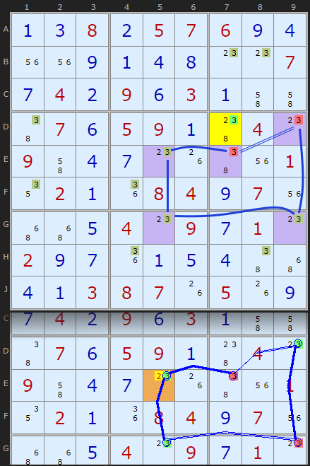
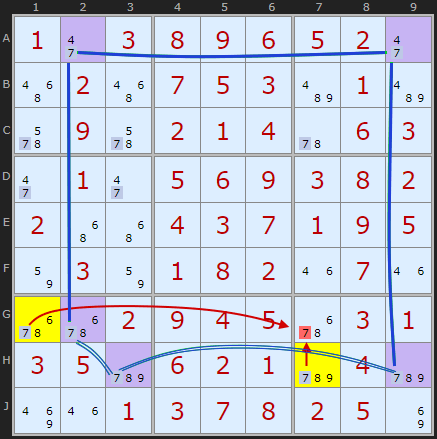
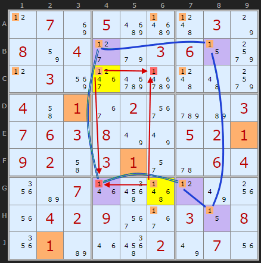
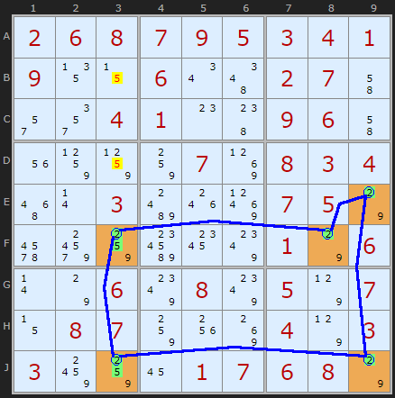

# 54 · Guardians (Broken Wings, Oddagons)

> **Level:** Diabolical · **Family:** Impossible patterns / single-digit loops · **Prerequisites:** [X-Cycles](../14-x-cycles/README.md) · **See also:** [Tridagons](../18-tridagons/README.md), which use the same "impossible pattern + guardian" logic
> Diagrams: [sudokuwiki.org/Guardians](https://www.sudokuwiki.org/Guardians) by Andrew Stuart (technique explained to him by Rod Hagglund). Text: original to this guide.

## In one sentence

A loop of an **odd** number of cells (5, 7, ...), each **perfectly paired** with the next (a strong link), is impossible. So if you find an odd loop that's *almost* perfect, the candidates that **spoil** it (the **guardians**) can't all be false.

## Why odd loops are impossible

Along a chain of strong links, the digit alternates ON, OFF, ON, OFF... Go round a loop with an **odd** number of cells and you get back to the start with the **opposite** state. That's a contradiction. So a perfect odd loop can never occur in a valid puzzle.

```
5-cell loop:  ON → OFF → ON → OFF → ON → (back to start, which must be OFF) ✗
```

A real puzzle avoids this because at least one link isn't perfect: some unit has a **third** candidate. Those extra candidates are the **guardians**, and **at least one guardian must be true**.

| Guardians | Conclusion |
|---|---|
| exactly **1** | it's true, so **place** the digit there |
| **2+** | any cell that sees **all** the guardians loses the digit, and that can include a loop cell |

---

## Worked examples

### Type 1: a single guardian



Digit **3**. The loop goes E7–E5 (row E), E5–G5 (column 5), G5–G9 (row G), G9–D9 (column 9), and then closes **imperfectly** through box 6, which has an extra 3. That extra 3 is the only guardian, so **it is the 3**. (A simple [X-Cycle](../14-x-cycles/README.md) gets the same result.)

▶ [Load position](https://www.sudokuwiki.org/sudoku.htm?bd=138257694009148007742963100076591040904700001021084970005409710297015400413870509)

### Type 2: two guardians



Digit **7**, with two imperfect links (**H3–H9** along row H and **H3–G2** in box 7). The guardians are **G1** and **H7** (yellow). They sit at opposite corners of a rectangle, so the cells that see both are the other two corners. H1 is already solved, so **G7** loses its 7, and that cracks the puzzle.

▶ [Load position](https://www.sudokuwiki.org/sudoku.htm?bd=103896520020753010090214063010569382200437195030182070002945031350621040001378250)

### Type 3: eliminating a loop cell



Digit **1**, with imperfect links **B4–G4** (column 4) and **G4–G7** (row G). The guardians are **C4** and **G6**. **G4**, which is part of the loop itself, sees both guardians, so it loses its 1.

▶ [Load position](https://www.sudokuwiki.org/sudoku.htm?bd=S9B0l078i05cacb4d037o0882042d9e03060z9w0l038y3he2e34d4a9w044i0136023mcyb603070603087u7u05020109024i03012q5u06041yb6071n5q570l7u1w1u0402093m37030z081y01b61m5q027u071u)

---

## Bonus: the bivalue oddagon



The same idea works with **cells** instead of one digit. Five cells in a loop, each `{2,9}` and each seeing the next, can't be filled: an odd cycle of two values always clashes. In this example (posted by borescoper), **F8, E9, J9** are `{2,9}`, and **F3, J3** are `{2,9}` **plus a 5**. Those 5s are the guardians, and at least one is true. Both are in column 3, so the other 5s in column 3 go.

▶ [Load position](https://www.sudokuwiki.org/sudoku.htm?bd=S9B02060807090503040109130z060u4e02074i2q2u04010o4809064i1u858584078l080304560r03bg1o8t07057o6ia484c01c80017o060r7o06800880057p070z0807841w8k047p03038c8416010706087o)

---

## How it connects

Guardian deductions are [X-Cycle](../14-x-cycles/README.md) / [AIC](../32-alternating-inference-chains/README.md) eliminations seen from another angle. The "find the impossible pattern, then trust its escape hatch" idea is the same one behind [Unique Rectangles](../17-unique-rectangles/README.md), [BUG](../11-bug/README.md) and [Tridagons](../18-tridagons/README.md).
