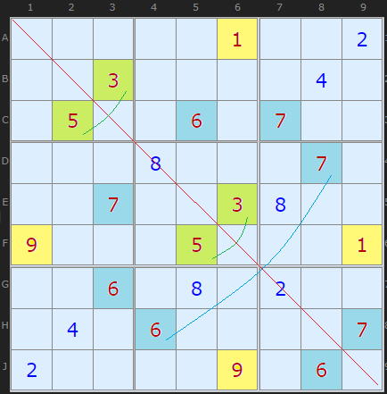
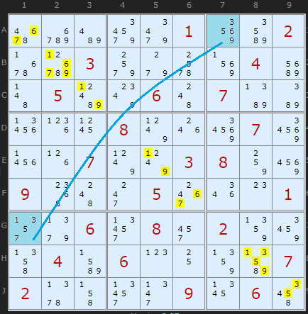
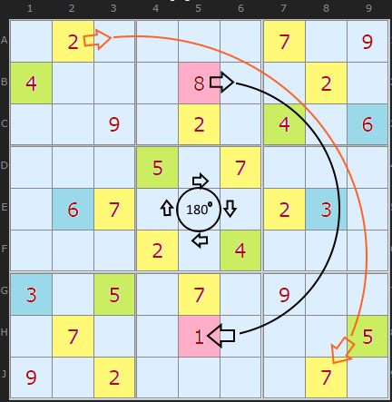
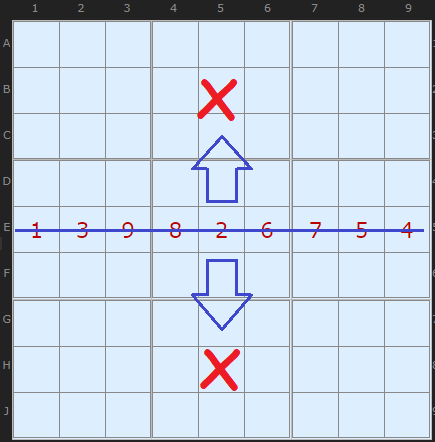
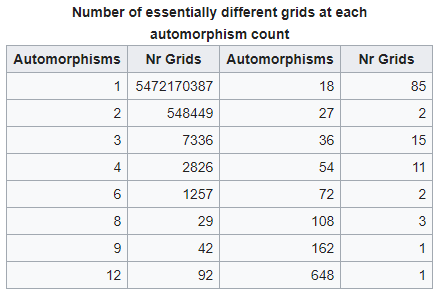
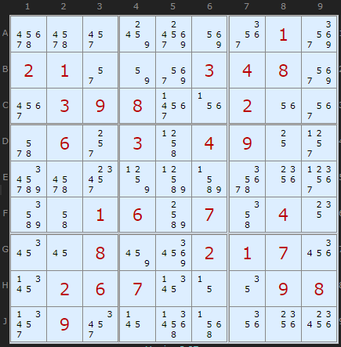

# 55 · Gurth's Symmetrical Placement Theorem

> **Level:** Special (only for symmetric puzzles) · **Family:** Symmetry / uniqueness · **Prerequisites:** none
> Diagrams: [sudokuwiki.org/Gurths_Theorem](https://www.sudokuwiki.org/Gurths_Theorem) by Andrew Stuart (popularised by Cracking the Cryptic's [video](https://www.youtube.com/watch?v=ac7Y97t2Wns)). Text: original to this guide.

## In one sentence

If a puzzle's givens are **symmetric** under some reflection or rotation **combined with a relabelling of digits**, and the puzzle has a unique solution, then the **solution is symmetric too**. Cells that map onto themselves can only hold digits that map onto themselves.

## The intuition

Imagine flipping the grid along its main diagonal **and** swapping 3↔5, 6↔7 and 1↔9. If that turns the givens back into exactly the same givens, then the transformed solution is *also* a valid solution to the same puzzle. A unique puzzle can't have two different solutions, so the solution must equal its own transform.

## Example: diagonal symmetry ("Shining Mirror")

Reflect across the **top-left → bottom-right diagonal**, and the givens map like this:

| Digit | maps to |
|---|---|
| 3 | 5 |
| 6 | 7 |
| 1 | 9 |
| 2, 4, 8 | themselves |

The cells **on the diagonal** (A1, B2, …, J9) map onto **themselves**. So they can only hold self-mapping digits: **{2, 4, 8}**. That's a huge elimination on the diagonal.

▶ [Load position](https://www.sudokuwiki.org/sudoku.htm?bd=000001002003000040050060700000800070007003800900050001006080200040600007200009060)

> ✅ **Every** given must have its partner in the mirrored position. A single unmatched given breaks the symmetry.

## Rotational symmetry (180°)

Rotate the grid half a turn about E5, then swap 1↔8, 2↔7, 3↔6, 4↔5. Only **9** maps to itself, and only **E5** maps to itself, so **E5 = 9**.

▶ [Load position](https://www.sudokuwiki.org/sudoku.htm?bd=020000709400080020009020406000507000067000230000204000305070900070010005902000070) · Also try [Riddle of Sho](https://www.sudokuwiki.org/sudoku.htm?bd=000000605000300090080004001040020970000000000031080060900600020010007000504000000)

## Which symmetries can work?

| Symmetry | Works? | Why |
|---|---|---|
| Diagonal reflection | ✅ | The diagonal cells are fixed. There must be at least 3 self-mapping digits. |
| 180° rotation | ✅ | Only E5 is fixed, and exactly one digit maps to itself. |
| Horizontal or vertical reflection | ❌ | The fixed axis is a whole row, so all 9 digits would have to map to themselves. That's not a real symmetry. |

## How useful is it?

Honestly, **rarely**. Symmetric puzzles almost never appear "in the wild", and sudokuwiki found none in its own large collections:

Also, once the givens are symmetric, the **whole candidate grid** is symmetric too. So the only new information is in the **self-mapping cells**. Elsewhere, symmetry just tells you that whatever you deduce on one side also holds on the other, which still halves your work.

### Edge case: a "ghost" mapping

This 180° puzzle looks symmetric, except that the digit **5** never appears as a given, so it has no mapping. If you put 5 in E5 (which maps to itself), the symmetry becomes complete.

▶ [From the start](https://www.sudokuwiki.org/sudoku.htm?bd=000000010210003480039800200060304900000000000001607040008002170026700098090000000)

## Practice: puzzles that need Gurth (set by Dominique Provent)

[1](https://www.sudokuwiki.org/sudoku.htm?bd=700020010080600700005004009010500090900000600003000004070010020600200900002003000) ·
[2](https://www.sudokuwiki.org/sudoku.htm?bd=100000000007800600040005003020003400000010090005600008030700004000090050006002700) ·
[3](https://www.sudokuwiki.org/sudoku.htm?bd=200000500070001090004500008001030060000800001050007900100006200060900040003050000) ·
[4](https://www.sudokuwiki.org/sudoku.htm?bd=200000400001400006040007030010004080000020009005100600100003007006800090030090500) ·
[5](https://www.sudokuwiki.org/sudoku.htm?bd=200000500070001090004500008001030050000800009050004200100002400060100070003060000)

**Further reading:** [Wikipedia: automorphic Sudokus](https://en.wikipedia.org/wiki/Mathematics_of_Sudoku#Automorphic_Sudokus)
